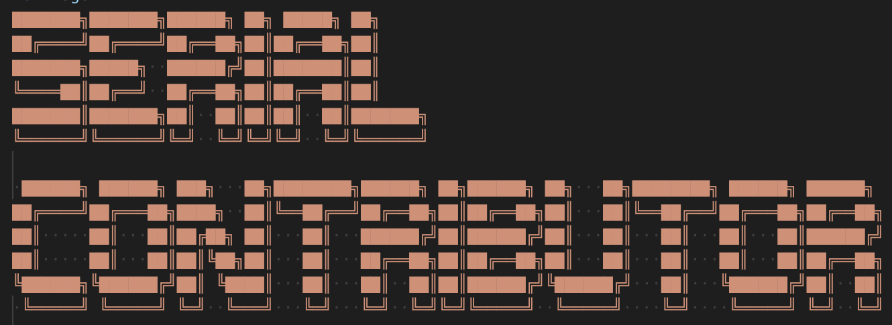
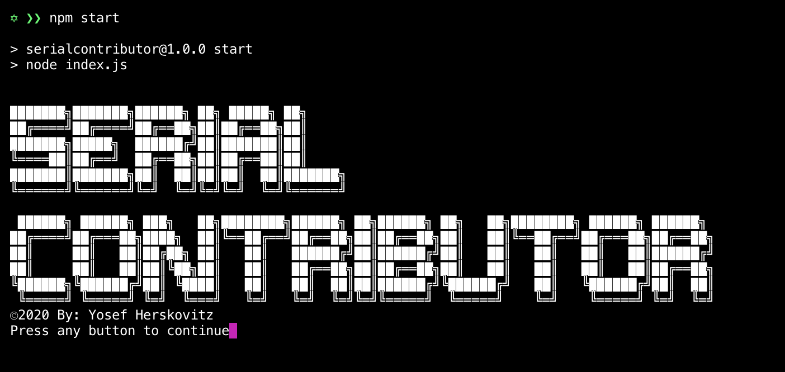
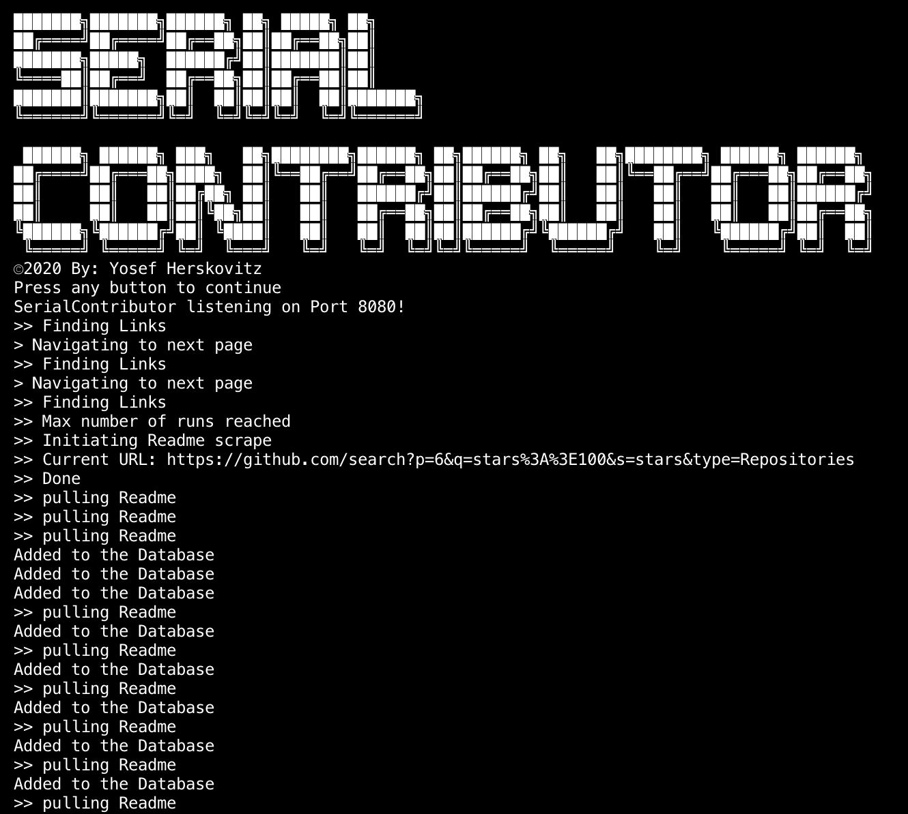
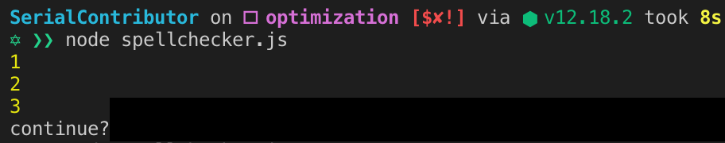
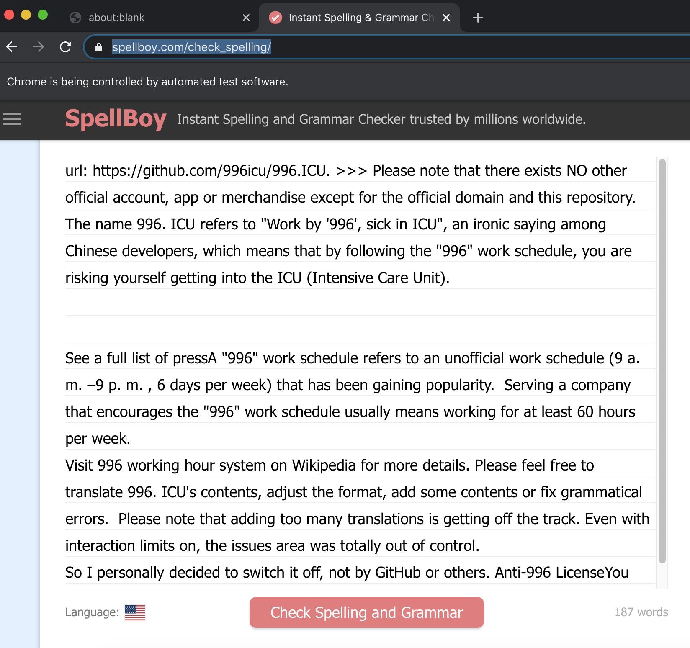
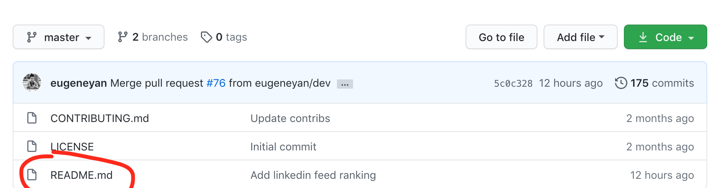
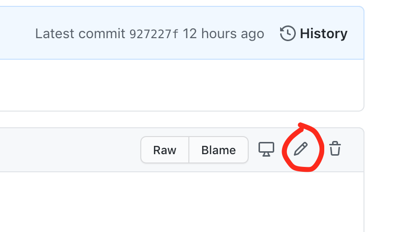
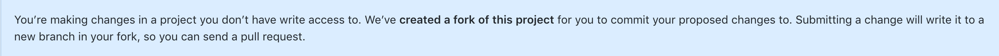
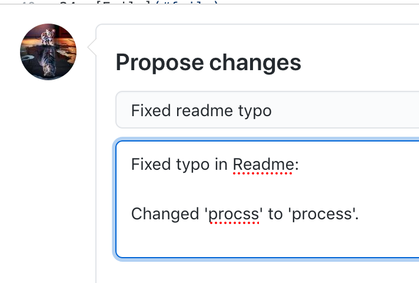

A tool for helping the Opensource community!

**!! Requires Node and Postgres !!**

To get started clone this repo and run `npm install`

Create a new postgres db called `serialcontributor`. If you have the postgres cli commands installed you can do this by running `createdb serialcontributor`.

Run `npm start`, and the program will start up.

You should see something like this:

Click any button to continue.

When you click a button, several things happen. SerialContributor pulls all 10 repo links from the [startingUrl](https://github.com/search?p=1&q=stars%3A%3E100&s=stars&type=Repositories) as defined in index.js line 12 and saves them
to the serialcontributor database that we created earlier. It then opens the page in a chromium window, and uses the open window to navigate to the next page. It
repeats itself 3 times, downloading all the urls to the database and then navigating to the next page.

Your console should look something like this:

Note: While SerialContributor is designed to bypass github's scraping restrictions, we still may get the occasional ECONNRESET error or githhub's scraping protection
error. While these are not a problem overall and you can just skip the repos that weren't downloaded, I recommend using a VPN which should lower the amount of repos
getting blocked.

When the code has stopped running, open a new terminal (keep the first terminal open! This is running our server and allows us to communicate with the database).
I use the terminal in vs code as we don't need a large window for the next step.

In the new terminal, run `node spellchecker.js`. This will open a spellchecking website in 3 new chromium windows, and then take 3 repo readmes that we have saved in
our databse (starting from the row id specified on line 43 of spellchecker.js), and then populate them into the spellchecker.

It should look like this:

In the chromium window, click the "check spelling and grammar" button on the bottom of the page, and the website will highlight any typos or grammatical errors!

-- Note --
The first thing listed in the spellchecker is the project's github url.
`url: https://github.com/996.ICU`. This gives quick access if you want to double check a typo or navigate to their page to correct one.

When you are done scanning through a readme, just close the chromium window and move on to the next one. When all three are complete, just go back to the second tab
and hit enter. It will then open the next three windows.

When you get to the end of all the readmes saved in the database, your have completed your first SerialContributor run. Each run constists of 30 repo readmes.

To start the next run:

1) Close the first terminal that was running the server. You can do this with `cntrl + c`

2) Edit the starting URL in index.js (line 13). You need to change the first number in the url (`...search?p=1...`) and add 3 to it. For the second run,
`https://github.com/search?p=1&q=stars%3A%3E100&s=stars&type=Repositories` becomes `https://github.com/search?p=4&q=stars%3A%3E100&s=stars&type=Repositories`.

3) In spellchecker.js, change the beginning variable on line 43. This is where your spellchecking function will begin iterating through your readmes. It should increase
by 30 every run as that is how many readmes we add to to our database in each run.

Once this is done, you can begin your second run by running `yarn start`.

## When you encounter a typo:
 Go to the github page for the project repo that contains the error and navigate to the readme file.

 

 After opening up the readme, click on the 'pencil' button on the top right to begin editing it.

 

 Github will automatically create a fork of this project for the pull request.

 

 Fix the typo then navigate to the bottom of the page and name your commit along with a brief description of what you fixed.

  

  Click on the Propose Changes button and that's it!

  You've made a pull request!

